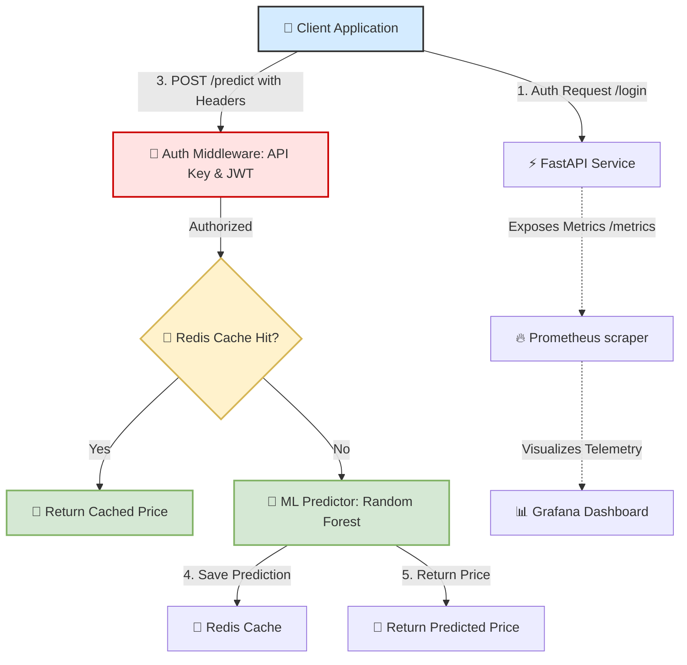
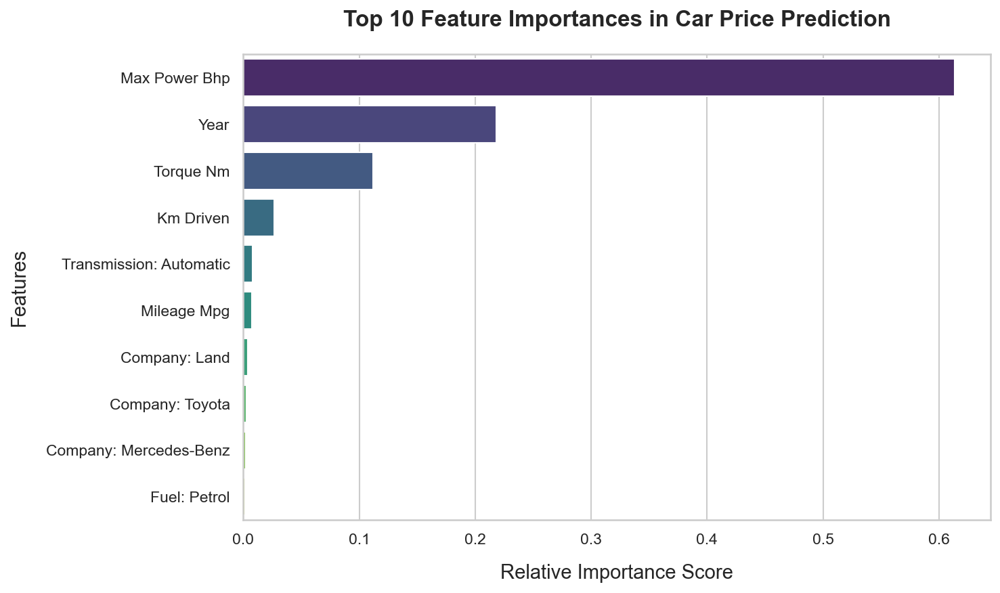
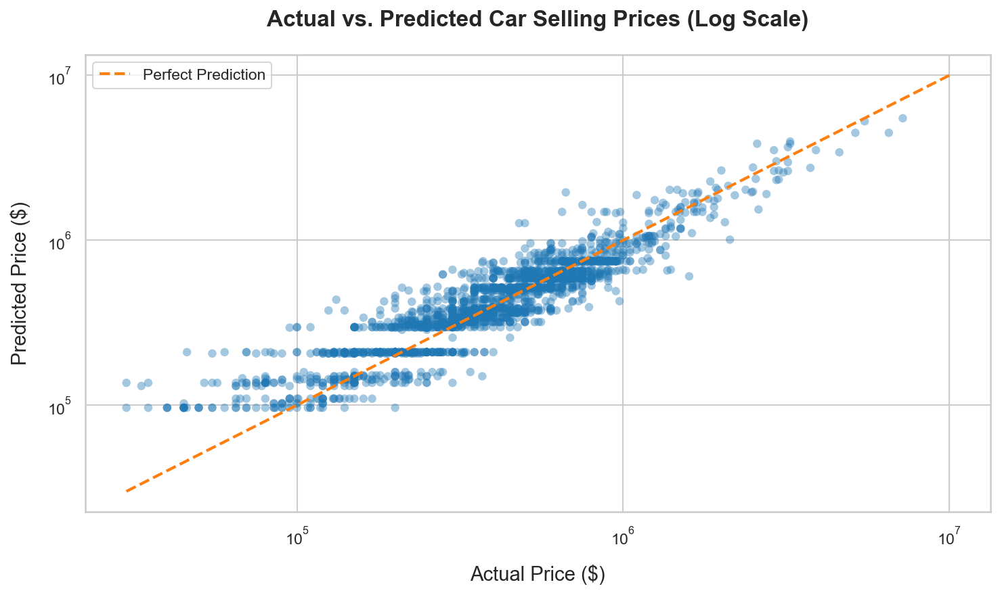

# 🚗 Car Price Prediction API

[](https://fastapi.tiangolo.com/)
[](https://scikit-learn.org/)
[](https://www.docker.com/)
[](https://redis.io/)
[](https://prometheus.io/)
[](https://grafana.com/)

An end-to-end machine learning microservice for **Car Price Prediction**, built on **FastAPI** and containerized with **Docker**. The system uses a **Random Forest Regressor** to estimate car values, incorporates a **Redis Cache** layer to ensure sub-millisecond response times for repeated queries, enforces double-layered authentication (API Keys & JWT Tokens), and exposes real-time telemetry metrics using **Prometheus** and **Grafana**.

---

## 🏗️ System Architecture & Data Flow

Below is the conceptual flow showing how client requests interact with our security middleware, prediction cache, ML engine, and telemetry agents.



---

## ⚡ Key Features

*   **Production-Grade Prediction Engine**: Preprocessing pipelines (imputers, scalers, and encoders) coupled with a tuned `Random Forest Regressor`.
*   **Sub-Millisecond Caching**: Seamless caching of prediction responses using Redis to minimize redundant model execution and maximize throughput.
*   **Dual-Layer Security**: Protecting routes via JWT token authentication and custom API Key validation.
*   **State-of-the-Art Telemetry**: Fully integrated Prometheus instrumentation monitoring request latency, CPU/memory usage, and success rates.
*   **Docker Orchestration**: Simple multi-container deployment orchestrating the FastAPI App, Redis, Prometheus, and Grafana using a single command.

---

## 🚀 Getting Started

You can run this project either **locally** for development or via **Docker Compose** for a production-like environment.

### Prerequisites

Ensure you have the following installed:
*   Python 3.10+
*   Docker & Docker Compose (optional, for containerized run)
*   Redis server (optional, if running locally)

### Option A: Local Development Setup

1.  **Clone the Repository**:
    ```bash
    git clone https://github.com/your-username/FastApi_Project.git
    cd FastApi_Project
    ```

2.  **Create a Virtual Environment**:
    ```bash
    python3 -m venv venv
    source venv/bin/activate
    ```

3.  **Install Dependencies**:
    ```bash
    pip install -r requirements.txt
    ```

4.  **Train the Model**:
    Build and save the RandomForest model pipeline:
    ```bash
    PYTHONPATH=. python3 training/train_model.py
    ```

5.  **Configure Environment Variables**:
    Create a `.env` file in the root directory:
    ```env
    API_KEY=demo-key
    JWT_SECRET_KEY=secret
    REDIS_URL=redis://localhost:6379
    ```

6.  **Run the Server**:
    Start the FastAPI application with Uvicorn:
    ```bash
    uvicorn app.main:app --reload --port 8000
    ```
    Access the interactive API docs at [http://127.0.0.1:8000/docs](http://127.0.0.1:8000/docs).

---

### Option B: Docker Compose Setup (Recommended)

Spins up the FastAPI app, Redis, Prometheus, and Grafana automatically:

```bash
docker-compose up --build
```

#### Services Exposed in Docker Compose:
*   **FastAPI API**: [http://localhost:8000](http://localhost:8000)
*   **API Documentation (Swagger)**: [http://localhost:8000/docs](http://localhost:8000/docs)
*   **Prometheus Console**: [http://localhost:9090](http://localhost:9090)
*   **Grafana Dashboard**: [http://localhost:3000](http://localhost:3000) (Default credentials: `admin` / `admin`)

---

## 📝 API Endpoints & Usage

### 1. User Authentication (`POST /login`)
Authenticate with credentials to receive a JWT access token.
*   **URL**: `/login`
*   **Payload**:
    ```json
    {
      "username": "admin",
      "password": "password"
    }
    ```
*   **Response**:
    ```json
    {
      "access_token": "eyJhbGciOiJIUzI1NiIsInR5cCI6IkpXVCJ9..."
    }
    ```

### 2. Predict Car Price (`POST /predict`)
Predicts the resale price of a car based on physical specifications.
*   **URL**: `/predict`
*   **Headers Required**:
    *   `x-api-key`: `demo-key`
    *   `token`: `<JWT_ACCESS_TOKEN>`
*   **Payload**:
    ```json
    {
      "company": "Maruti",
      "year": "2014",
      "owner": "First",
      "fuel": "Diesel",
      "seller_type": "Individual",
      "transmission": "Manual",
      "km_driven": 145500.0,
      "mileage_mpg": 55.0,
      "engine_cc": 1248.0,
      "max_power_bhp": 74.0,
      "torque_nm": 190.0,
      "seats": 5.0
    }
    ```
*   **Response**:
    ```json
    {
      "predicted_price": "450,000.00"
    }
    ```

---

## 📊 Model Training & Evaluation

The predictive model is trained using a **Random Forest Regressor** with a Column Transformer to handle numerical scaling (StandardScaler) and categorical encoding (OneHotEncoder).

### Feature Importances
The chart below highlights the top 10 features that contribute to the price prediction:



*Key Insights*: **Max Power (BHP)** and **Engine Capacity (CC)** are the dominant predictors, followed by the manufacturing **Year** and **Torque**.

### Model Performance
Here is the Actual vs. Predicted plot demonstrating how well the predictions align with the 45-degree target line (perfect prediction):



*Metrics*:
*   **Train RMSE**: $169,947.49$
*   **Test RMSE**: $172,392.13$

---

## 🤝 Contributing, Feedback & Pull Requests

We love contributions! Whether you are a seasoned engineer or just starting out with Machine Learning APIs, your input is incredibly valuable.

### How to Contribute:
1.  **Fork** the repository.
2.  Create a **new branch** (`git checkout -b feature/awesome-feature`).
3.  **Commit** your changes (`git commit -m 'Add awesome feature'`).
4.  **Push** to the branch (`git push origin feature/awesome-feature`).
5.  Open a **Pull Request** and describe your enhancements!

### Feedback & Suggestions:
If you spot a bug or have a suggestion to improve the prediction pipeline, feel free to:
*   Open an [Issue](https://github.com/your-username/FastApi_Project/issues) to report bugs.
*   Start a discussion for new features or enhancements.
*   Give this project a ⭐ if you found it useful!

---

License: MIT. Made for learning and experimentation.
